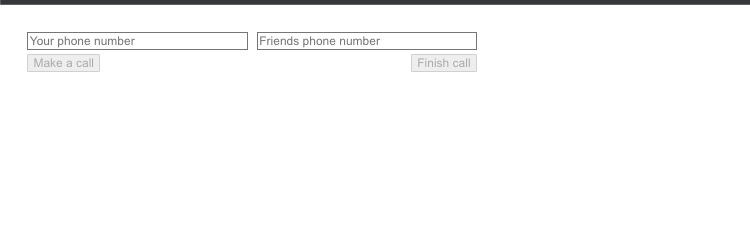
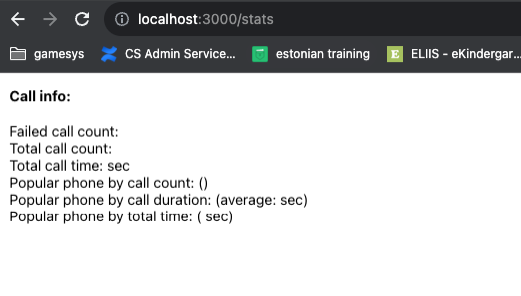
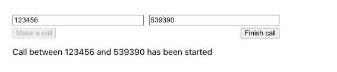
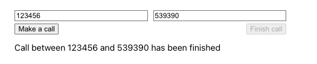
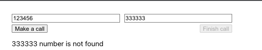
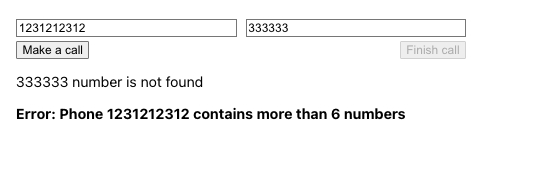
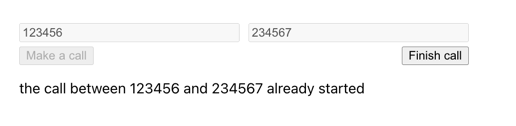

# subscriber-call-service

## Contents

* [Description](#description)
* [Run](#run)
* [Usage](#usage)

## Description

Service manages calls between different subscribers. It has simple UI

To start a call you write two numbers: initial and receiving phones.
**Make a Call** button runs call between subscribers.
**Finish call** button finishes call.
To check statistic you should visit `/stats` page




## Run
### Docker Compose
You can run the application via `docker-compose.yml`.
Run command `docker-compose up`.

In this case all components following containers will be started:

1. `postgres` - main  database container

Database includes two tables: `subscribers` and `events`.
Subscribers table contains data at start the container:

#### Subscribers

|     id      | name |
|:-----------:|:----:|
|   123456    | "Danny" |
|   234567    | "Miguel"  |
|   345678    | "Jackson"  |
|  539390     | "Garry"  |

#### Events

| id | status | init_phone | hidden_info | receiving_phone |     date_created     |
|:--:|:------:|:----------:|:-----------:|:---------------:|:--------------------:|
|    |   |            |             |                 |  |


**Initialization data can be changed in `create.sql` file.** in _subcriber-call-manager-service/service/create.sql_


2. `subscriber-call-app-service` - application with UI and BFF
3. `subcriber-call-manager-service` - container that runs unit and integration tests


Sometimes there can be issue with retrieving dependency for `cybercube-service` container. (Maybe I have bad connection)
You can just re-run containers: `docker-compose down`,`docker-compose up`


## Usage

After running the service you can manage calls:

init table has the next number:
#### Subscribers

|     id      | name |
|:-----------:|:----:|
|   123456    | "Danny" |
|   234567    | "Miguel"  |
|   345678    | "Jackson"  |
|  539390     | "Garry"  |

1. Open `http://localhost:3000`
2. Call management:

2.1 So if you try any call with  numbers from db you will see next:


**When initialization phone makes a call it means that initialized phone exists in DB!**

**Initialization phone can make several calls at the same time**

3.2 And after finish call it looks like


3.3 If you try to call not existed subscriber you will see: 


3.4 if number is more than 6 symbols then the error appears


3.5 if you call again with the same number in another tab, then you got notification that call already started



4 To create new user just use curl

```
curl --location 'localhost:8083/subscriber-call-manager/service/subscriber' \
--header 'Content-Type: application/json' \
--data '{
        "phone": 333333,
        "name": "Johny"
}'
```

4. To see statistics open `localhost:3000/stats`


 
